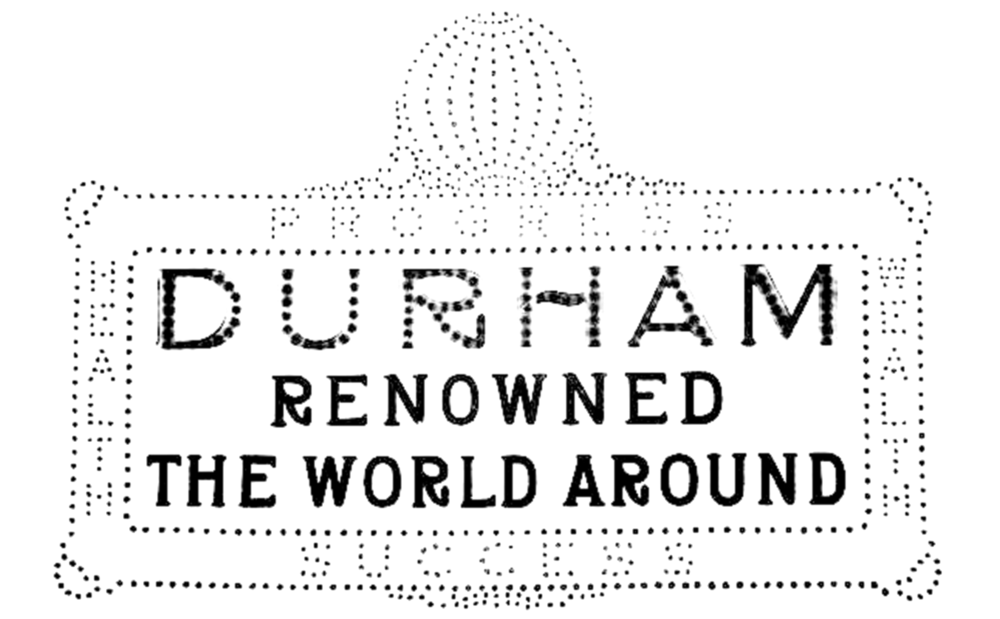
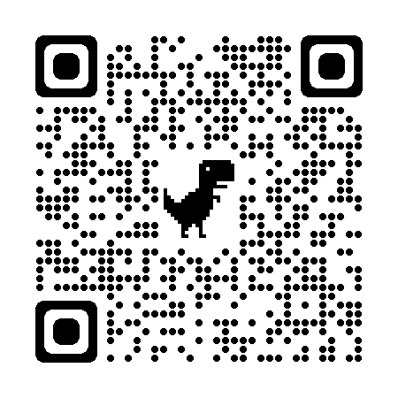

# Durham Renowned

One hundred years ago, an electric sign was unveilied in downtown Durham. The project in this repository is an edge-lit acrylic scale model of that sign. Please read the short section of Jim Wise's "Durham Tales", pages 84-86 for more context. I dream of one day building a full-scale, modern update of the sign, but for now, this model will suffice.

-- David Bradway

## Tools used

- Duke Co-lab 3-D printers
- Duke Co-lab laser cutter
- Soldering station
- Circuit Python Code
- Tutorials from Adafruit
  - I took inspiratrion from here https://learn.adafruit.com/acrylic-neopixel-lamp?view=all
  - I took and adapted CAD files, code and parts lists from here https://learn.adafruit.com/led-acrylic-sign?view=all

## Link to project repository

https://gitlab.oit.duke.edu/dpb6/durham-renowned

## License
The MIT License
SPDX short identifier: MIT

Copyright 2023 David P Bradway

Permission is hereby granted, free of charge, to any person obtaining a copy of this software and associated documentation files (the “Software”), to deal in the Software without restriction, including without limitation the rights to use, copy, modify, merge, publish, distribute, sublicense, and/or sell copies of the Software, and to permit persons to whom the Software is furnished to do so, subject to the following conditions:

The above copyright notice and this permission notice shall be included in all copies or substantial portions of the Software.

THE SOFTWARE IS PROVIDED “AS IS”, WITHOUT WARRANTY OF ANY KIND, EXPRESS OR IMPLIED, INCLUDING BUT NOT LIMITED TO THE WARRANTIES OF MERCHANTABILITY, FITNESS FOR A PARTICULAR PURPOSE AND NONINFRINGEMENT. IN NO EVENT SHALL THE AUTHORS OR COPYRIGHT HOLDERS BE LIABLE FOR ANY CLAIM, DAMAGES OR OTHER LIABILITY, WHETHER IN AN ACTION OF CONTRACT, TORT OR OTHERWISE, ARISING FROM, OUT OF OR IN CONNECTION WITH THE SOFTWARE OR THE USE OR OTHER DEALINGS IN THE SOFTWARE.
